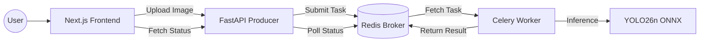

# 🚀 YOLO Vision AI: Distributed Classification System

[](https://nextjs.org/)
[](https://fastapi.tiangolo.com/)
[](https://docs.celeryq.dev/)
[](https://tailwindcss.com/)
[](https://daisyui.com/)

A high-performance, scalable, and distributed image classification system. This project demonstrates a decoupled architecture where heavy AI inference is separated from the web server using task queues.

---

## 🏗️ Architecture

The system is divided into three main components to ensure maximum reliability and a smooth user experience:

| Component | Role | Tech Stack | Deployment |
| :--- | :--- | :--- | :--- |
| **`web/`** | Premium Dashboard | Next.js 16, Tailwind 4, DaisyUI 5 | Vercel |
| **`producers/`** | Task Dispatcher (API) | FastAPI, Celery (Producer) | Hugging Face |
| **`consumers/`** | AI Inference Node | Celery (Worker), ONNX Runtime | Hugging Face |
| **Broker** | Message Queue | Redis / RabbitMQ | CloudAMQP / Upstash |



---

## 📂 Directory Structure

```text
ai_web/
├── web/                # Frontend: Next.js + Tailwind 4
├── producers/          # Backend API: FastAPI + Celery Task Sender
├── consumers/          # AI Worker: Celery + ONNX Model Inference
├── pt2onnx/            # (Archive) Model export scripts
├── docker-compose.yml  # Local orchestration
└── README.md           # Documentation
```

---

## ⚡ Quick Start (Local Development)

### Prerequisites
- [Docker & Docker Compose](https://www.docker.com/products/docker-desktop/) (Highly Recommended)
- [Node.js 20+](https://nodejs.org/) (For manual frontend dev)
- [Python 3.11+](https://www.python.org/) (For manual backend dev)

### 🐳 Way 1: Docker (Fastest)

1. Clone the repository.
2. Run the entire stack:
   ```bash
   docker-compose up --build
   ```
3. Access the components:
   - **Frontend**: [http://localhost:3000](http://localhost:3000)
   - **API Docs (Swagger)**: [http://localhost:8000/docs](http://localhost:8000/docs)

### 🛠️ Way 2: Manual Setup

1. **Start Redis**:
   ```bash
   docker run -p 6379:6379 redis:alpine
   ```

2. **Run Backend (Producer)**:
   ```bash
   cd producers
   pip install -r requirements.txt
   python main.py
   ```

3. **Run AI Worker (Consumer)**:
   ```bash
   cd consumers
   pip install -r requirements.txt
   # Set MODEL_PATH env if different
   celery -A worker worker --loglevel=info
   ```

4. **Run Frontend**:
   ```bash
   cd web
   npm install
   npm run dev
   ```

---

## 🌐 Deployment Guide

### 1. Hugging Face Spaces (Producers & Consumers)
- Both `producers` and `consumers` folders contain a **Dockerfile** optimized for Hugging Face.
- **Consumer**: Ensure `yolo26n-cls.onnx` is present in the `consumers/` directory.
- **Environment Variables (HF Secrets)**:
  - `REDIS_URL`: Your cloud Redis URL (e.g., `redis://:password@endpoint:port/0`).

### 2. Vercel (Frontend)
- Link your `web/` directory to Vercel.
- **Environment Variables**:
  - `NEXT_PUBLIC_API_URL`: The public URL of your FastAPI Space.

---

## 🛰️ API Reference

### Upload Image
`POST /upload`
- **Body**: `multipart/form-data` with `file`
- **Response**: `{"task_id": "...", "status": "PENDING"}`

### Check Status
`GET /status/{task_id}`
- **Response**: `{"status": "SUCCESS", "result": { ... }}`
